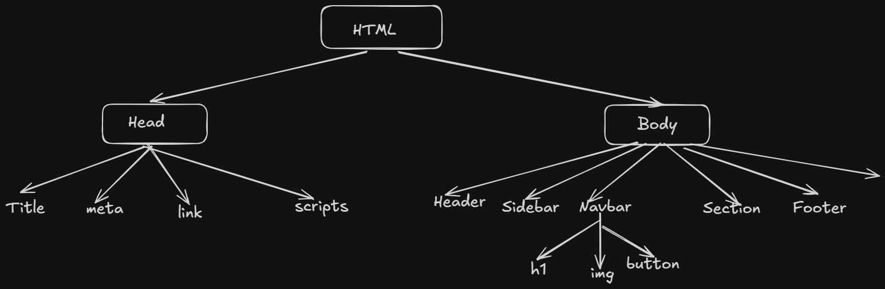

## What is React.js ?
- A js library used to make UI (FRONTEND).
- Can build complex library, build by meta on 2013.
- Most demanding skill for now

### 1. Why needed ?
- When fb had two many users, some problems occured because built with html,css and js earlier. The website does not show new things without a reload or did not get any notification without reload the page.
- So, fb need someting which can auto reload.
- React creates component based architecture. when one component need to reload then only that component should be reload instead of totally page.

### 2. Library vs Framework
- Library
    - GSAP
    - Lenis
    - React.js
- Framework
    - Nextjs
    - Angular
- Difference
    - Library used for one perticular feature
        - Analogy:- Make a home with your own customization in your plot
    - Framework used for all included
        - Analogy: Buy a flat and can not customize according to you

### 3. Import vs Export :-
- How to work with multiple files ?
    - Importing one file in another file.
    - Without export we can not import.
- Types of Export:-
    - Name Export :- Use when we need to export more than one things
    - Default Export :- Use when we need to export one thing

### 4. DOM:-
- Stands for Document Object Model
- There are two doms
    - Real DOM
    - Virtual DOM
#### Real DOM:-

    - When we use normal html,css and js. If i want to change h1 which is in Navbar section, the total dom of webpage updated. This is the main problem of real dom.
#### Virtual DOM:-
- Copy of Real DOM by react.
- When we need to change something like when click on button the h1 should change, Incase of virtual DOM when we click on button then behind the scene the virtaul DOM compare with Real DOM and change what actually need to change not updated total DOM like real DOM.
- It makes the app faster.

### 5. JSX:-
- Combination of HTML and js
- When we have to create an html in js that is very mehnat wala things.
- But in case of jsx, `var h1 = <h1> </h1>`
    ```jsx
    function Hello(){
        console.log("Hello");
    }
    ```


### 6. Bundler:-
- For now we create react bundler using `npm create vite@latest`
- After installation we got vite bundler for using react. 
- There are some folders and files will coming after installation.


    ```
    project-root/
    │
    ├── public/                # Static files (served directly)
    │
    ├── src/                   # Main source code
    │   ├── assets/            # Images, icons, etc.
    │   ├── App.css            # Styles for App component
    │   ├── App.jsx            # Root React component
    │   ├── main.jsx           # Entry point (React starts here)
    │   └── index.css          # Global styles
    │
    ├── .gitignore             # Files ignored by Git
    ├── eslint.config.js       # ESLint configuration
    ├── index.html             # Root HTML file
    ├── package.json           # Project dependencies & scripts
    ├── package-lock.json      # Dependency lock file
    ├── README.md              # Project documentation
    └── vite.config.js         # Vite configuration
    ```

### 7. Break the code of what you get as default
#### 1. node_modules:-
    - All libraries present what we need for the project
#### 2. public folder:-
    - files for access
#### 3. src folder:-
    - As usual we get Main.jsx, App.jsx, App.css and App.jsx
#### 4. eslint.config.js:-
```js
import js from '@eslint/js'
import globals from 'globals'
import reactHooks from 'eslint-plugin-react-hooks'
import reactRefresh from 'eslint-plugin-react-refresh'
import { defineConfig, globalIgnores } from 'eslint/config'

export default defineConfig([
  globalIgnores(['dist']),
  {
    files: ['**/*.{js,jsx}'],
    extends: [
      js.configs.recommended,
      reactHooks.configs.flat.recommended,
      reactRefresh.configs.vite,
    ],
    languageOptions: {
      ecmaVersion: 2020,
      globals: globals.browser,
      parserOptions: {
        ecmaVersion: 'latest',
        ecmaFeatures: { jsx: true },
        sourceType: 'module',
      },
    },
    rules: {
      'no-unused-vars': ['error', { varsIgnorePattern: '^[A-Z_]' }],
    },
  },
])
```
- We can think that as code quality checker + strict teacher
- Without ESLint:
    - You may write buggy code ❌
    - Inconsistent coding style ❌
    - Hard to maintain project ❌
- With ESLint:
    - Cleaner code ✅
    - Fewer bugs ✅
    - Industry-standard practices ✅
- `import js from '@eslint/js'` :- Default js rules
- `import globals from 'globals'`:- Gives browser globals like window, document
- `import reactHooks from 'eslint-plugin-react-hooks'`:- Check react hook rules
- `import reactRefresh from 'eslint-plugin-react-refresh'`:- Helps with vite fast refresh
- `import { defineConfig, globalIgnores } from 'eslint/config'`:- Helps define config properly.

#### 5. index.html :-
- Main root file which serves to the browser.
#### 6. package.json:-
- All project dependecies and scripts present in this
#### 7. package-lock.json:-
- Project dependecies locked here
#### 8. README.md:-
- Documentation
#### 9. vite.config.js:-
- Configuration for vite

### 8. Components in React:-
- Component is like multiple function which can be reusable.
- Like Button, Navbar, Sidebar and etc...
- In react there are two types of components
    - Class component (old not useful for now)
    - Function Component
- How to use Components ?
    ```js
    import Card from "./components/Card.jsx"
    function App() {
    return (
        <div>
            <Card />
        </div>
    );
    }
    ```
    - Here `Card` is a component and used in App.jsx

### 9. Props:-
- Props stand for properties are used to pass data from one component to other- typically from a parent component to child component.
```js
import React from 'react'

const Card = ({name}) => {
  return (
    <div className='bg-amber-300 px-4 py-2 text-center'>
      <h1 className='text-2xl mb-2'>Card</h1>
      <p className=''>Hello I am {name}'s card</p>
    </div>
  )
}

export default Card
```

```js
import React from 'react'
import Card from './components/Card'

const App = () => {
  return (
    <div>
      <Card name={"Priyansu"}/>
    </div>
  )
}

export default App
```

- In this case, Card is a child component and App is parent component. here name which is a properties pass from App can use in Card via props drilling.
> #### What is props drilling ?
- Passing props from parent to child and so on known as props drilling.

- ##### **Things to remember**
    - Props are read only means can not change in child component.
    - We can pass mulltiple props. _*if we pass written as props we can access like props.name or props.email like that*_. If we pass multiple props we have to use curly braces if we have not use any single name props 
    ```js
    import React from 'react'
    import Card from './components/Card'

    const App = () => {
    return (
        <div>
        <Card name={"Priyansu"} email={"HgYbG@example.com"}/>
        </div>
    )
    }

    export default App
    ```
    ```js
    import React from 'react'

    const Card = ({name, email}) => {
    return (
        <div className='bg-amber-300 px-4 py-2 text-center'>
        <h1 className='text-2xl mb-2'>Card</h1>
        <p className=''>Hello I am {name}'s card</p>
        <p>{email}</p>
        </div>
    )
    }

    export default Card

    ```

    > We can do the same thing by writing props only
    ```js
    import React from 'react'

    const Card = (props) => {
    return (
        <div className='bg-amber-300 px-4 py-2 text-center'>
        <h1 className='text-2xl mb-2'>Card</h1>
        <p className=''>Hello I am {props.name}'s card</p>
        <p>{props.email}</p>
        </div>
    )
    }

    export default Card

    ```

### 10. Hooks in React:-
- Hooks are functions that let you use React features (state, lifecycle, etc.) inside functional components.
- Before hooks:- Only class components could use state & lifecycle
- After hooks: Functional components can do everything ✅
- There are many hooks in react.
    - **useState Hook**:- Manage state or we can say that used to store data and update the data in a component.
    - **useEffect Hook**:- Manage side effects
        - Used for api calls, times, DOM updates etc...
        - syntax:- `useEffect(() => {}, [])`
    - **useRef** :- useRef is a React Hook that gives you a persistent, mutable reference that does NOT cause re-renders when it changes.
        - Used for select something.
        - Get reference of something.
    - **useContext** :-
        - Manage global contexts in react.
        - We use props drilling via grandparents to parents then child then grandchild and so on..
        - But useContext gives me chance to connect with grandparents and grandchild rather than step wise via keeps it globally.
    - **useReducer**:- Manage complex logic.
        - Do the same thing what useState does means i mean to say that useState can do work for simple logic like change a variable but useReducer can work on complex logic where there are many conditions.
        ```js
        const reducer = (state, action) => {
        switch(action.type){
            case "increment":
            return { count: state.count + 1 }
            case "decrement":
            return { count: state.count - 1 }
            default:
            return state
        }
        }

        const [state, dispatch] = useReducer(reducer, { count: 0 })
        ```
        | Feature         | useState 🟢    | useReducer 🔵           |
        | --------------- | -------------- | ----------------------- |
        | Complexity      | Simple         | Complex logic           |
        | Code Style      | Direct         | Structured (Redux-like) |
        | Multiple States | Hard to manage | Easy                    |
        | Debugging       | Hard           | Easier                  |
        | Scalability     | Low            | High                    |

        > Difference through code
        - Lets think there is a condition where we have to save the count, step and history of a user and also need to change while increase.
        > If we use useState:
        ```js
        const [count, setCount] = useState(0)
        const [step, setStep] = useState(1)
        const [history, setHistory] = useState([])

        // logic spread everywhere
        ```
        > If we use useReducer:-
        ```js
        const reducer = (state, action) => {
        switch(action.type){
            case "increment":
            return {
                ...state,
                count: state.count + state.step,
                history: [...state.history, state.count]
            }
            default:
            return state
        }
        }
        ```
        - Where to use what ?
            - useState:
                - form input
                - toggle
                - count
                - simple UI state
            - useReducer:
                - form with many fields
                - complex state transitions
                - Dashboard /large apps
                - When logic becomes messy
    - **useMemo** :- For optimization, avoid unnecessary re-renders for value only
        ```js
        import React, { useMemo, useState } from 'react'

        const ExpensiveComponent = () => {
        const [count, setCount] = useState(0)

        const expensiveCalculation = (num) => {
            console.log("Calculating...")
            return num * 2
        }

        const result = useMemo(() => {
            return expensiveCalculation(count)
        }, [count])

        return (
            <>
            <p>Result: {result}</p>
            <button onClick={() => setCount(count + 1)}>Increase</button>
            </>
        )
        }
        ```
        - In this code count does not re-render in every time, but rerender when the count value changes.
    - **useCallback** :- Same as useMemo but act for functions.

        ```js
        import React, { useState, useCallback } from 'react'

        const Parent = () => {
        const [count, setCount] = useState(0)

        const handleClick = useCallback(() => {
            console.log("Clicked")
        }, [])

        return (
            <>
                <Child onClick={handleClick} />
                <button onClick={() => setCount(count + 1)}>Increase</button>
            </>
        )
        }

        const Child = React.memo(({ onClick }) => {
        console.log("Child Rendered")
        return <button onClick={onClick}>Click</button>
        })
        ```
        - Here handleClick does not re-render every single time but when click on the button it only re-renders
    
#### 1. useState :-
- We use react useState hook to handle a variable and a function to change the value of this variable and main important thing also re-render with this.
- Ex:-
    ```js
    import React from 'react'

    const App = () => {
    var num = 0
    const setNum = () => {
        num += 1
        console.log(num)
    }
    return (
        <div>
        <h2>Value: {num}</h2>
        <button onClick={setNum}>Increment</button>
        </div>
    )
    }

    export default App

    ```
    - In this code we can change the value but it automatically does not show in UI.
    > Now the question is without useState can our value renders in UI.
    - Answer is yes but we have to use useRef and a force re-redner. those are completely messy.
    - ans:- "React does not track normal variables. Only state updates trigger re-renders, which is why useState is required for updating UI."
    > Then how useState can do that ?
    - ans:- It is compltely internal core or react. useState stores data outside of the componet. It tells react when to re-render.

    > Using useState

    ```js
    import React from 'react'
    import { useState } from 'react'

    const App = () => {
    const [num,setNum] = useState(0)
    return (
        <div>
            <h2>Value: {num}</h2>
            <button onClick={() => setNum(num + 1)}>Increment</button>
        </div>
    )
    }

    export default App
    ```
    > Interview Question
    ```js
    import React from 'react'
    import { useState } from 'react'

    const App = () => {
    const [num, setNum] = useState(0)
    const handleIncrease = () => {
        setNum(num + 1)
        console.log(num)
    }
    return (
        <div>
        <h1>{num}</h1>
        <button onClick={() => handleIncrease()}>Click</button>
        </div>
    )
    }

    export default App
    ```
    > What print on console after first click and what renders in ui page also ?
    - In console there is 0 print but in UI page 1 renders becasue setNum works asynchronously. It goes to event loop, between that time console get printed.

    > Change an object using useState
    ```js
    import React from 'react'
    import { useState } from 'react'

    const App = () => {
    const [user, setUser] = useState({name: "priyansu", age: 20})
    const handleIncrease = () => {
        setUser({...user, age: user.age+1})
        console.log(user)
    }
    return (
        <div>
        <h1>{user.name}</h1>
        <h2>{user.age}</h2>
        <button onClick={() => handleIncrease()}>Click</button>
        </div>
    )
    }

    export default App
    ```

### 11. Form Handling in react:-
    ```js
    import React from 'react'

    const App = () => {

    const submitHandler = (e) => {
        e.preventDefault()
        console.log("Submitted")
    }

    return (
        <div>
        <form onSubmit={(e) => submitHandler(e)} className='flex flex-col gap-3 items-center'>
            <input className='border w-full p-2 ' type="text" placeholder='Type Name...'/>
            <input className='border w-full p-2 mb-2' type="email" placeholder='Type email...'/>
            <button type='submit' className='w-32 text-center border h-10 rounded-lg cursor-pointer'>Submit</button>
        </form>
        </div>
    )
    }

    export default App

    ```
- Form has a default behaviour when its submitted it reload the page, we have to prevent it using `preventDefault()`.


### 12. Two way binding in react :-
- React doesn’t have “true” two-way data binding like Angular (ngModel). Instead, it follows a one-way data flow, but we can achieve two-way binding behavior using state + event handlers.
- **How it works in react ?**:-
    - We store the data in state
    - Display it in the input as value
    - Update state on user input as onChange.
    ```js
    import React, { useState } from 'react'

    const App = () => {
    const [name, setName] = useState("");

    const handleChange = (e) => {
        setName(e.target.value);
    };

    return (
        <div>
        <input 
            type="text" 
            value={name} 
            onChange={handleChange} 
        />
        <p>You typed: {name}</p>
        </div>
    );
    }

    export default App

    ```
    - Here we set the name as value of input. then change using useState.

### 13. localStorage :-
- localStorage is a web API in JavaScript that lets us store data in the browser persistently (it stays even after refresh or closing the tab).
- Basic Usage:-
    - save data:- `localStorage.setItem("key", "value")`
    - get data:- `localStorage.getIten("key")`
    - remove data:- `localStorage.removeItem("key")`
    - clear everything:- `localStorage.clear()`
- Example:-
    ```js
    const user = { name: "John", age: 25 };

    // Save
    localStorage.setItem("user", JSON.stringify(user));

    // Get
    const storedUser = JSON.parse(localStorage.getItem("user"));
    ```
- key points:-
    - Data persists across browser sessions.
    - Storage limit ~5mb (varies by browser).
    - Same origin only (domain specific).
    - Synchronous

